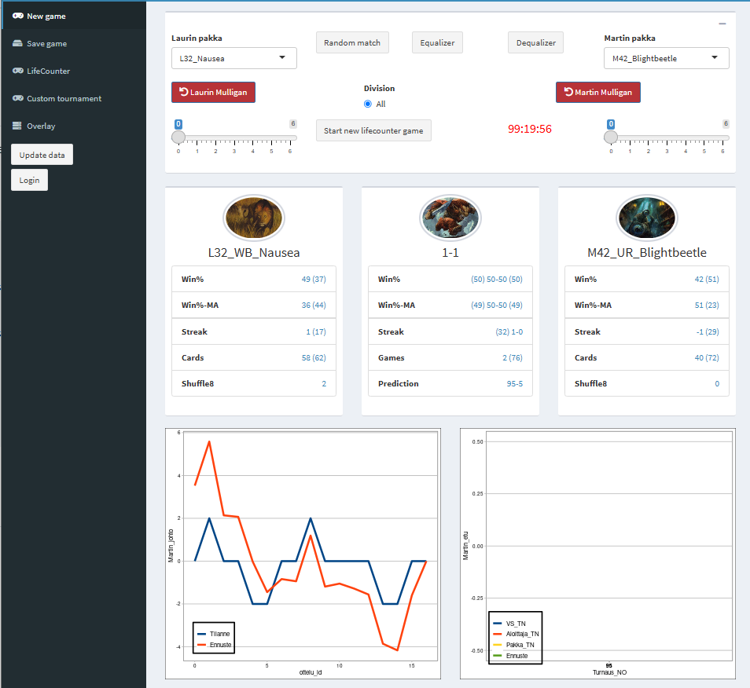

<h1 align="center">Lauri Lepistö</h1>
<h3 align="center">Data & AI Leader | Enterprise Architect | Driving Business Transformation through Data Strategy & Advanced Analytics</h3>

  Experienced professional with a proven track record in designing, developing, and deploying end-to-end data and AI solutions. Specializing in leveraging advanced analytics, machine learning, and robust data architectures to solve complex business challenges and drive strategic growth.

<h3 align="left">Strategic Capabilities:</h3>
<ul>
  <li><strong>Architecting Data-Driven Futures:</strong> Designing and implementing comprehensive data strategies and governance frameworks that serve as the bedrock for innovation, operational excellence, and sustainable business growth. My approach ensures data is a strategic asset, driving value and compliance.</li>
  <li><strong>Leading with Advanced Analytics & AI:</strong> Spearheading the creation and deployment of sophisticated AI/ML models and advanced analytical solutions. The focus is always on translating data insights into actionable strategies that deliver measurable business impact and inform executive decision-making.</li>
  <li><strong>Building Resilient Enterprise Data Ecosystems:</strong> Engineering scalable, secure, and high-performance data platforms (Data Lakes, Warehouses, Lakehouses) across multi-cloud landscapes (AWS, Azure, GCP). This involves architecting for current needs while anticipating future technological shifts and business demands.</li>
  <li><strong>Delivering End-to-End Data & AI Products:</strong> Overseeing the full lifecycle of data and AI solutions – from conceptualization and infrastructure design (Docker, R Shiny Server on AWS) to backend development (R, Python), database architecture (SQL, data modeling), and the creation of intuitive user interfaces (Shiny). This demonstrates a holistic understanding of product delivery and software engineering best practices applied to data.</li>
  <li><strong>Cultivating High-Impact Data Teams:</strong> Building, mentoring, and leading high-performing data and analytics teams. My leadership fosters a culture of innovation, continuous learning (e.g., early adoption of dbt, MCP tools), and a relentless focus on delivering business value.</li>
  <li><strong>Driving Transformation through Data:</strong> Championing data literacy and translating complex technical capabilities into clear business outcomes. Proven ability to leverage data to drive significant cost savings, optimize operations (e.g., inventory optimization, logistics network analysis), and unlock new revenue streams.</li>
</ul>

<h3 align="left">Featured Projects:</h3>

These projects highlight my hands-on technical expertise and my ability to architect and deliver complex data and AI solutions from concept to deployment. They demonstrate a strategic approach to problem-solving, a commitment to robust engineering, and a passion for leveraging technology to create value.

<h4><a href="https://github.com/Laurigit/mstat">Magic the Gathering: End-to-End Data & Analytics Ecosystem</a></h4>

  This project involved architecting and building a full-stack R-based ecosystem for comprehensive Magic the Gathering data management, statistical analysis, and interactive visualization. Beyond a hobbyist endeavor, it serves as a microcosm of enterprise data platform development, showcasing:
  <ul>
    <li><strong>Strategic Data Architecture:</strong> Designing a robust data model and database schema capable of handling complex, evolving game data, ensuring efficient querying and analytical performance. This mirrors the challenges of designing scalable data warehouses or data marts in a business context.</li>
    <li><strong>Full-Stack Engineering with R & Shiny:</strong> Demonstrating proficiency in R for backend data processing, API development, and statistical computation, coupled with Shiny for creating dynamic, user-friendly interfaces. This highlights the ability to deliver complete, interactive data products. The entire application is containerized with Docker and hosted on AWS, showcasing cloud deployment and operational management skills.</li>
    <li><strong>Advanced Analytics Application:</strong> Implementing sophisticated statistical analyses to derive insights into game dynamics, player performance, and strategic trends – skills directly transferable to business analytics, customer segmentation, or performance monitoring.</li>
    <li><strong>Product Ownership & Iteration:</strong> The project's evolution, including separate repositories for a [Deck builder](https://github.com/Laurigit/draft) and [Life counter](https://github.com/Laurigit/client), demonstrates an iterative development approach and an understanding of modular design, crucial for managing complex software projects.</li>
  </ul>
  

    
  

<h4><a href="https://github.com/Laurigit/flAImme">Flamme Rouge: Strategic AI Agent Development</a></h4>

  Developing an AI to master the strategic board game Flamme Rouge showcases advanced capabilities in AI/ML algorithm design, simulation, and optimization. This project goes beyond simple model training, demonstrating:
  <ul>
    <li><strong>Complex AI/ML System Design:</strong> Architecting an intelligent agent that employs linear programming and multi-agent reinforcement learning (specifically Fictitious Play) to navigate complex decision spaces and optimize for long-term strategic advantage. This reflects the ability to tackle sophisticated AI challenges relevant to business optimization, resource allocation, or competitive strategy.</li>
    <li><strong>Strategic Problem Solving:</strong> The core of this project lies in translating the nuanced strategies of a board game into a formal AI framework, requiring deep analytical thinking and innovative problem-solving – key attributes for a data or AI leader.</li>
    <li><strong>Simulation & Performance Optimization:</strong> The AI's ability to play autonomously and effectively implies robust simulation capabilities and attention to performance, ensuring the agent can make timely and informed decisions within the game's constraints.</li>
    <li><strong>Application of Advanced AI Concepts:</strong> This project demonstrates a practical understanding and application of cutting-edge AI techniques, showcasing a commitment to staying at the forefront of AI development.</li>
  </ul>

<h3 align="left">Core Technical Proficiencies:</h3>

My technical foundation is built on a deep understanding of modern data engineering principles, cloud architectures, and the application of software engineering best practices to the data domain. This enables me to not only lead strategically but also to engage deeply with technical teams and architectural decisions.

<ul>
  <li><strong>Cloud Architecture & Deployment:</strong> Proficient in designing, deploying, and managing data solutions on <strong>AWS</strong> (hosting R Shiny servers, leveraging various services), <strong>Azure</strong> (implemented logistics optimization tools), and <strong>Google Cloud Platform</strong> (extensive experience with BigQuery, VertexAI, Workflows).</li>
  <li><strong>Data Engineering & Modern Data Stack:</strong> Early adopter and implementer of <strong>dbt</strong> for building robust and scalable data transformation pipelines. Extensive experience in <strong>data modeling</strong>, designing data marts, and leading <strong>data migration</strong> projects (e.g., on-prem Matillion to Google BigQuery).</li>
  <li><strong>Full-Stack Application Development (Data Focus):</strong> Expertise in <strong>R</strong> and <strong>Shiny</strong> for developing end-to-end analytical applications, including UI, backend logic, and database interaction. Proficient in <strong>Python</strong> for AI/ML development and data engineering tasks.</li>
  <li><strong>Containerization & CI/CD:</strong> Utilizing <strong>Docker</strong> for creating portable and scalable applications (e.g., R Shiny server). Applying software engineering best practices like <strong>CI/CD</strong>, <strong>Git</strong> (fluent on command line, GitLab, GitHub), and code reviews to data development workflows.</li>
  <li><strong>Advanced Analytics & AI/ML Implementation:</strong> Practical experience in developing and deploying solutions for <strong>time-series forecasting</strong>, <strong>inventory optimization</strong>, <strong>logistics network optimization</strong> (linear programming), and complex AI agents using <strong>multi-agent reinforcement learning</strong> and <strong>Model Context Protocol (MCP)</strong> tools.</li>
  <li><strong>Business Intelligence & Visualization:</strong> Experience with <strong>Power BI</strong> for developing enterprise reporting solutions and managing teams of <strong>QlikSense</strong> developers.</li>
</ul>

<h3 align="left">Connect with Me:</h3>
<ul>
  <li><strong>LinkedIn:</strong> https://www.linkedin.com/in/lauri-lepisto/</li>
</ul>

